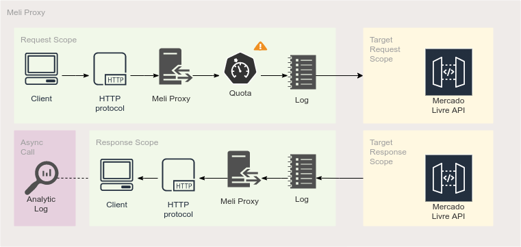
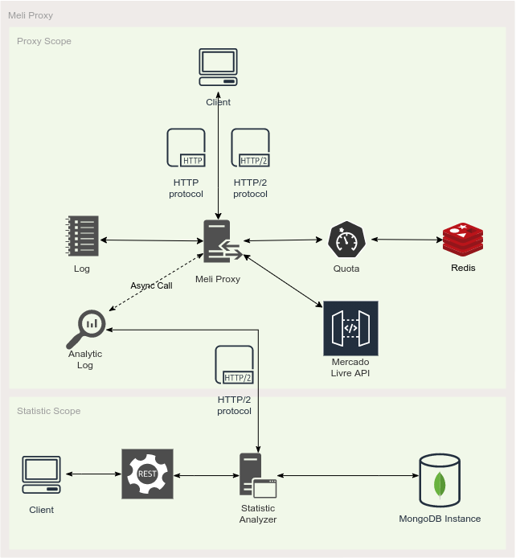
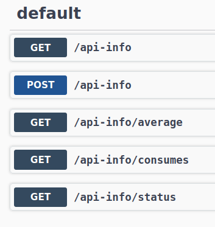

# meli-proxy

Meli-Proxy is an API Proxy develop for [Mercado Livre API](https://developers.mercadolibre.com.ar/pt_br) 
to control all calls with quota policy and statistic anlytics.

## Quota policy

You can configure quota per:

- Calling IP
- API Path
- Calling IP + API Path
- API Path + AppId
- API Path + UserId

To see how to run core proxy see [here](core/README.md)

## Statistic analyzer

You can analyze the use of each API, with the follwing fields:

- BasePath
- ResponseTime
- ResponseCode
- AppId
- UserId
- Average ResponseTime per API
- Sum of call per API
- Quantity of per ResponseCode by API

To see how to run core proxy see [here](statistic-analyzer/README.md)

## MeliProxy Flow

MeliProxy support http1.1 and http2 protocols, after receive request MeliProxy 
validates Quota Limits and make a call to MercadoLivreAPI.

After before send response to client, MeliProx make an asynchronous http call to 
Statistic Analyzer Service.

## MeliProxy Components

MeliProxy uses [Redis](https://redis.io/) to save information about api calls and
apply quota policy based on [configurations](core/README.md#proxy-configuration)

StatisticAnalyzer uses [MongoDB](https://www.mongodb.com/) to save all analytics information
about api Calls, see [AnalyticModel](statistic-analyzer/README.md#statistic-analyzer) for more info.

## Satistic Analyzer Swagger

You can access your SwaggerUiPage by navigate http://host:port/q/swagger-ui

